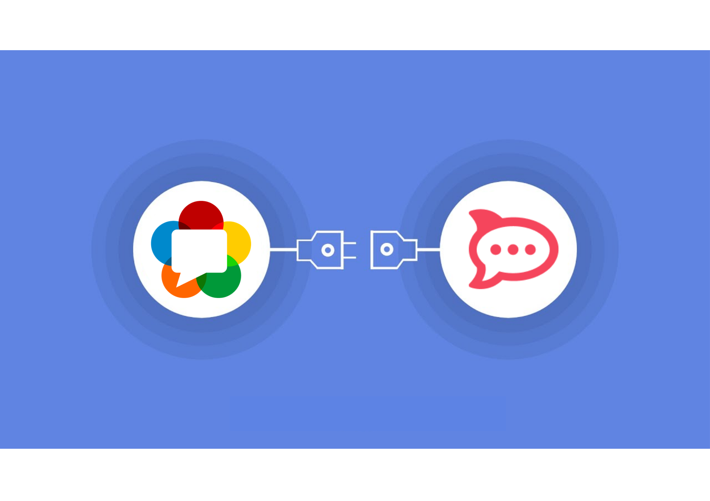

    
     
    <b> 
        

        Introduce audio calls to <a href="https://rocket.chat/">RocketChat's</a> LiveChat
        

    </b>

    <b>
        <a href="#project-abstract">Project Abstract</a>&nbsp;&nbsp;&nbsp;
        <a href="#work-product">Work Product</a>&nbsp;&nbsp;&nbsp;
        <a href="#contributions">Contributions</a>&nbsp;&nbsp;&nbsp;
        <a href="#future-scope">Future Scope</a>&nbsp;&nbsp;&nbsp;
        <a href="#mentors">Mentors</a>&nbsp;&nbsp;&nbsp;
        <a href="#contact-me">Contact Me</a>
    </b>

 A journey that will always remain close to my :heart: 

## Project Abstract

+ The goal for the project was to add the capability of **audio calls** in **RocketChat's LiveChat** solution using **P2P webRTC architecture**.

+ Omnichannel is a feature offered by Rocket.Chat that allows companies to handle leads and clients in a multi-channel environment using a single platform. LiveChat is one of those multi-channel environments.

+ Livechat is a modern helpdesk application that helps connect a live-agent with a visitor in real-time using a pop-up widget on the companies’ website without installing anything on their devices.

+ This project will now allow agents to initiate audio/video calls with the visitors to provide better onboarding experience and support.

+ According to [The Microsoft 2017 State of
Global Customer Service Report](http://info.microsoft.com/rs/157-GQE-382/images/EN-CNTNT-Report-DynService-2017-global-state-customer-service-en-au.pdf), “30% of consumers expressed that not being able to reach a real person when they needed to was the most frustrating part of a poor customer service experience.” This project will help bridge the gap and build a sense of trust with the customers.

## Work Product

The final product / deliverable is integrated with **Rocket.Chat core app and LiveChat widget** on `livechat-calls` feature branch :rocket:  
<b>[Rocket.Chat](https://github.com/RocketChat/Rocket.Chat/pull/23004) &nbsp;|&nbsp; [LiveChat](https://github.com/RocketChat/Rocket.Chat.Livechat/pull/638) &nbsp;|&nbsp; [LiveChat SDK](https://github.com/RocketChat/Rocket.Chat.js.SDK/pull/144) </b>

    <a href="https://drive.google.com/file/d/1qk3_az54c1g8jLsynn1qVFGTDX21fYsg/view?usp=sharing">
     
    <b> 
        

        Click here to watch the working demo of the product
        

    </b>
    </a>

 

[Click here](https://drive.google.com/file/d/13crQBsoOgPFeVGITlOpWzzz6vQl_K9zA/view?usp=sharing) to watch how an admin can enable call support in livechat.

[Click here](https://drive.google.com/file/d/156t7amtfYQOB44O4cEe9p0NkTnUnoeSK/view?usp=sharing) to watch Jitsi calling in LiveChat.

**My Features List:**  
+ Enable WebRTC button and settings to select call provider(WebRTC/Jitsi) to enable call initiation from agent’s side.
+ Agent side start call button along with join call and end call action messages.
+ Call session storing capability using messages collection.
+ 1:1 audio/video call support for LiveChat users using P2P webrtc implementation.
+ Switching between avatar screen and video using the camera control button.
+ Mic on/off button and End Call button.
+ Call expand view button.
+ UI Responsiveness to render the meet inside widget and on mobile.
+ WebRTC API documentation in developer docs.
+ Complete user(admin/agent) flow documentation in user docs.

## Contributions

| Type | Rocket.Chat | Rocket.Chat.Livechat | Rocket.Chat.js.SDK | Developer-Docs |
|:---------|:------------| :------------------- | :----------------- | :----------------- |
| **Pull Requests** | [8](https://github.com/RocketChat/Rocket.Chat/pulls?q=is%3Apr+author%3Adhruvjain99) | [2](https://github.com/RocketChat/Rocket.Chat.Livechat/pulls?q=is%3Apr+author%3Adhruvjain99) | [1](https://github.com/RocketChat/Rocket.Chat.JS.SDK/pulls?q=is%3Apr+author%3Adhruvjain99) | [1](https://github.com/RocketChat/Developer-Docs/pulls?q=is%3Apr+author%3Adhruvjain99) |
| **Commits** | [7](https://github.com/RocketChat/Rocket.Chat/commits/livechat-calls?author=dhruvjain99) | [2](https://github.com/RocketChat/Rocket.Chat.Livechat/commits/livechat-calls?author=dhruvjain99) | - | - |

**E2E Testing Results**
- Browsers: Mozilla Firefox 90.0.2
- STUN/TURN: Xirsys (free)
- Networks: Different
- Distance: ~715Km
- Call Duration: 24 minutes
- In Audio Bytes Rx: 14434543
- In Video Bytes Rx: 363243439
- Out Video Bytes Tx: 371435664
- Out Audio Bytes Tx: 14934321
- Lip Sync: Ok

**Other Contributions**
- Helped UI/UX team in Discovery Phase - finalizing the designs.
- Documented the implementation approaches [here](https://docs.google.com/document/d/11g72exqFF5_XVNx92HuETA2Gd-IAwsFRuam6NLFD5fY/edit#heading=h.tbbc9pq4ofh8) to tackle the project idea.  

**My Project Board:** https://github.com/orgs/RocketChat/projects/37 

## Future Scope

I'll be resolving the bugs that were encountered during E2E testing and benchmarking(noted on my project board). There is 1 open PR related to documentation that needs to be reviewed and 1 documentation PR is in progress. Finally I'll be coordinating with the team to release this feature as the first version of audio/video calls in the Rocket.Chat's release cycle.

## Mentors

Special thanks to my mentors for guiding me throughout the course of the program so that I was always on track and able deliver the project efficiently in the end.

+ **Murtaza Patrawala**&nbsp; &nbsp;[GitHub](https://github.com/murtaza98) &nbsp; [LinkedIn](https://www.linkedin.com/in/murtaza-patrawala-b17419166/)
+ **Gabriel Henriques**&nbsp; &nbsp;[GitHub](https://github.com/gabriellsh) &nbsp; [LinkedIn](https://www.linkedin.com/in/gabrielschnorr/)

## Contact Me

| **Student** | Dhruv Jain |
|:--------------------|:-------------------|
| **Organization** | [Rocket.Chat](https://rocket.chat/) |
| **Project** | [Introduce audio calls to LiveChat](https://summerofcode.withgoogle.com/projects/#5285209030787072) |
| **Email** | <a href="mailto:dhruv.jain93@gmail.com">dhruv.jain93@gmail.com</a> |
| **Rocket.Chat** | [@dhruv.jain](https://open.rocket.chat/direct/n44bjdgSkfp2o73q2) |
| **GitHub** | [@dhruvjain99](https://github.com/dhruvjain99) |
| **LinkedIn** | [@dhruvjain99](https://www.linkedin.com/in/dhruvjain99/) |
| **Twitter** | [@dhruv_jain99](https://twitter.com/dhruv_jain99) |
| **Medium** | [@dhruvjain99](https://dhruvjain99.medium.com/) |
| **HackerOne** | [@dhruvjain99](https://hackerone.com/dhruvjain99?type=user) |

- [My GSoC Proposal](https://docs.google.com/document/d/1Oxh3JU7ayho9KWTjDp0xfAEO2m5tgMHtwbVOG1zyy4o/edit)
- [My Final Presentation Slides](https://docs.google.com/presentation/d/1owIrdaanRCmFTd1FYceqxhTVRaDhOM-UkxY1qc0KbLs/edit?usp=sharing)
